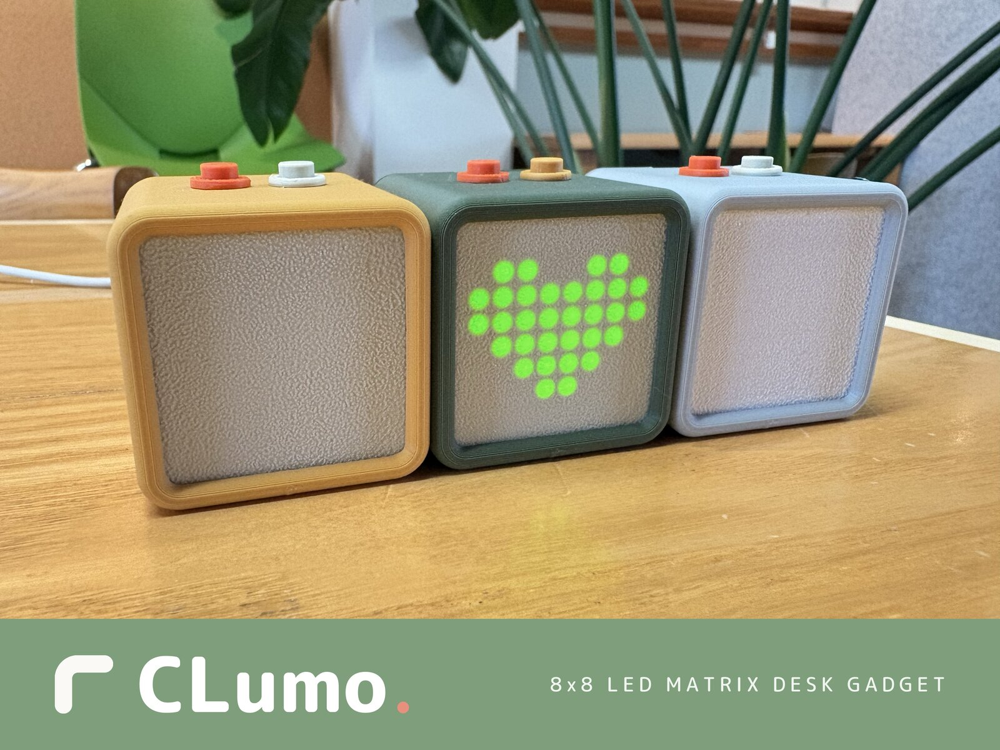

# CLumo

[English] | [日本語 (README.ja.md)](README.ja.md)

CLumo is a palm-sized desk gadget built around an ESP32-C3, an 8x8 LED matrix (MAX7219), and two buttons. It sits on your desk as a tiny companion: a digital pet, a pomodoro timer, a dice roller, or a display you can draw on from your phone.

## Two ways to use it

CLumo ships with two independent firmware variants. Pick one and flash it. You can always switch later.

### 1. Standalone firmware: no app required

Works with just the two buttons; no Bluetooth or phone setup.

- Digital pet: feed it, watch its mood and idle animations
- Pomodoro timer: 25/5 work-break cycles on the LED matrix
- Dice: roll a die with one press

Hold one of the two buttons to cycle between modes; the [standalone README](standalone/) lists what each button does in each mode. Your current mode and pet state survive power cycles.

### 2. Companion firmware + Android app

Connects to the CLumo Android app over BLE for richer features.

- Pomodoro: app-configurable work/break cycles shown as a 64-pixel countdown
- Timer: a one-shot countdown from `00:01` to `59:59`, with start, pause, resume, and cancel controls
- My Displays: draw custom 8x8 patterns in the app and send them to the device
- Audio visualizer: the matrix dances to audio streamed from your phone

## Quick start

1. Flash the firmware from your browser, no tools to install:
   **https://cespresso.github.io/CLumo/**
   Choose standalone or companion, plug in the device over USB, and click install. Powered by ESP Web Tools; works in Chrome and Edge on desktop, and in Android Chrome via USB-OTG.
2. For the companion firmware, download `clumo.apk` from the [latest GitHub Release](https://github.com/Cespresso/CLumo/releases/latest), install it, and pair with the device using passkey `123456`.

## Repository layout

| Path | Contents |
|---|---|
| [`standalone/`](standalone/) | Standalone firmware (Rust, no BLE): pet / pomodoro / dice |
| [`companion/firmware/`](companion/firmware/) | Companion firmware (Rust + BLE): pomodoro / timer / my displays / visualizer |
| [`companion/android/`](companion/android/) | CLumo Android app (Kotlin, Gradle) |
| [`installer/`](installer/) | Browser-based installer page (ESP Web Tools, served via GitHub Pages) |
| [`hardware/`](hardware/) | Assembly guide, wiring diagram, and 3D-printable enclosure |

## Building from source

Each subproject is self-contained and has its own README with full instructions:

- Firmware ([`standalone/`](standalone/), [`companion/firmware/`](companion/firmware/)): Rust nightly, ESP-IDF v5.2.2, target `riscv32imc-esp-espidf`. Build with `cargo build --release`, flash with `espflash`.
- Android app ([`companion/android/`](companion/android/)): a standard Gradle project. Run `./gradlew assembleDebug` or open it in Android Studio.

## Hardware

- MCU: Seeed XIAO ESP32-C3
- Display: 8x8 LED matrix driven by a MAX7219 (SPI)
- Input: two tactile buttons

The enclosure is five 3D-printed parts. There are no screws or glue: the XIAO snaps into a printed frame, every wire ends in a JST XH connector, and the only soldering is three pin headers. The [assembly guide](hardware/assembly/) walks through the build with photos and includes the parts list and wiring diagram. The 3D model is in [`hardware/models/`](hardware/models/).

## License

[MIT](LICENSE)
