# CLumo 組み立てガイド

[English](README.md) | 日本語

必要な作業として大きなものは、はんだ付け（ピンヘッダ程度）と JST XH の圧着です。配線の結び方は手順 3 の配線図にまとめてあります。
※ JST XHコネクタを使わずに全て半田付けでも組み立てすることは一応可能ですが、難易度や取り回しの問題から非推奨です。このページではコネクタありで進めます。

## 用意するもの

図 1 が部品を並べたところです。JST コネクタ類は写真に写っている数より多く必要なので、数は下の表で確認してください。

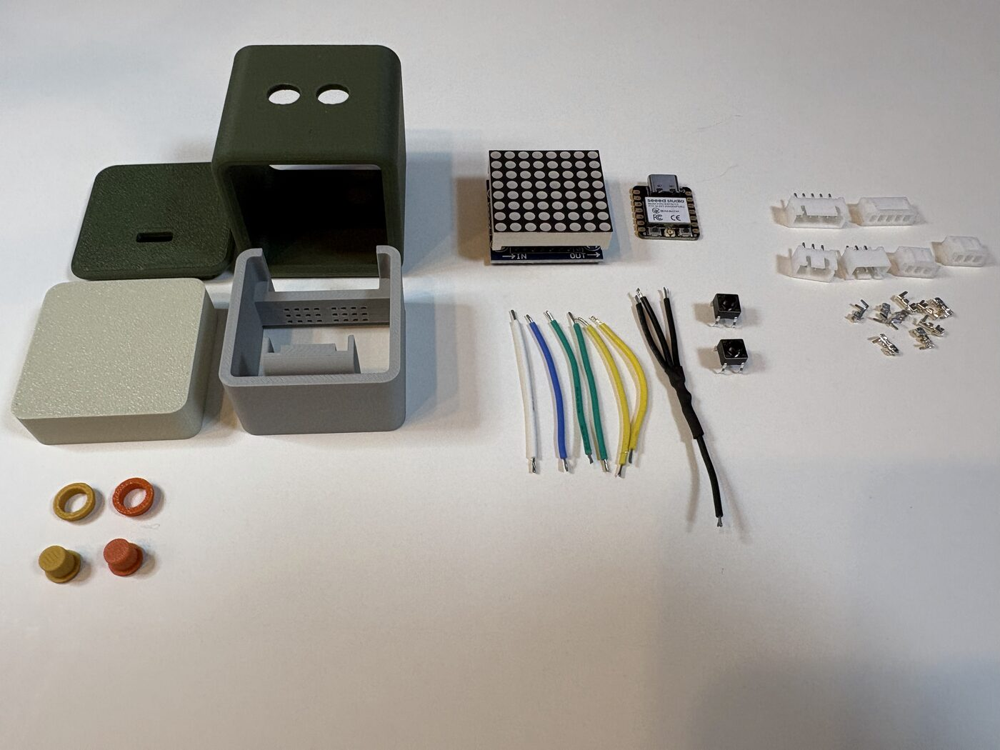

図 1: 造形物と電子部品を並べた状態です。JST 部品は一部しか写っていません。

### 電子部品

| 部品 | 数 | 備考 |
|---|---|---|
| Seeed XIAO ESP32-C3 | 1 | |
| MAX7219 8x8 LED マトリクスモジュール | 1 | 基板が 32 mm 角の一般的なもの |
| タクトスイッチ 6x6 mm | 2 | 4 本足のもの |
| 熱収縮チューブ | 少々 | GND のスプライスを覆う分 |

### JST XH 2.54 mm

互換品のキットで揃います。基板側ヘッダはすべてストレートです。

| 部品 | 数 | 用途 |
|---|---|---|
| 5 ピン 基板ヘッダ | 2 | XIAO 左列 / マトリクス IN |
| 2 ピン 基板ヘッダ | 1 | XIAO 右列 |
| 5 ピン ハウジング | 2 | XIAO 左列側 / マトリクス側 |
| 2 ピン ハウジング | 1 | XIAO 右列側 |
| 3 ピン ハウジング | 2 | ボタン。両端の 2 極だけ使い、真ん中は空けます |
| 圧着コンタクト | 16 | |

### 電線

長さはどれも 5 cm 前後。
自分で作った感じこれより短いと取り扱いが難しく、いくらか長くはできますが、逆に長すぎるとケースに収まらなくなるので注意してください。

| 種類 | 本数 | つなぐ区間 |
|---|---|---|
| 色線 | 4 | XIAO と マトリクスの間（3V3 / D10 / D9 / D8） |
| 色線 | 2 | XIAO と各ボタンの間（D1 / D2） |
| 黒 | 4 | GND。XIAO から 1 本、途中で 3 本に分岐してマトリクスと両ボタンへ |

### 造形物

図 2 の 5 種類です。ボタンは軸受とキャップの 2 部品で、色を変えて刷るとアクセントになります。3D データは [`clumo.3mf`](../models/clumo.3mf) です。

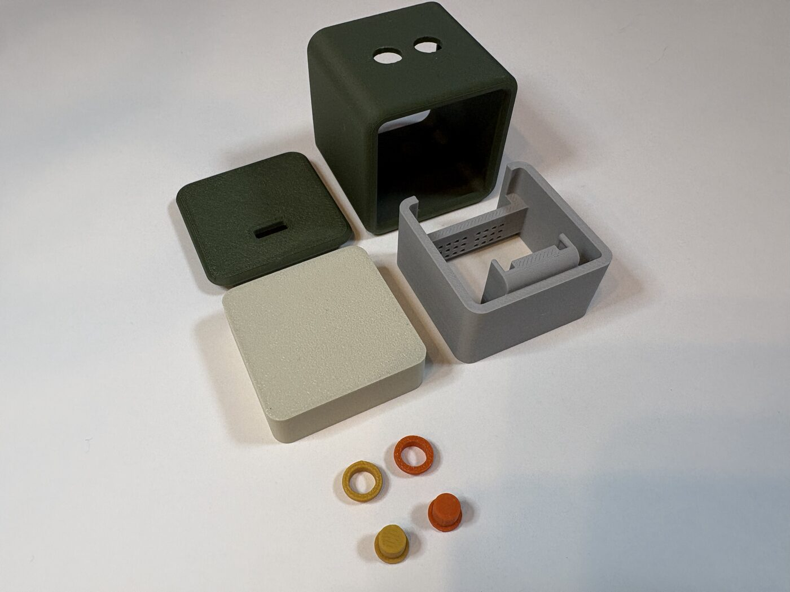

図 2: 造形物は外装シェル、背面パネル、トレイ、骨格、ボタン 2 組です。

| 部品 | 写真の色 | 役割 |
|---|---|---|
| 外装シェル | 濃緑 | 天面にボタン用の丸穴 2 つ、前後に大きな穴 |
| 背面パネル | 濃緑 | 背面の口を塞ぐ。細長い穴が USB-C の差し込み口 |
| トレイ | 白 | マトリクスをはめる浅い箱。底がそのまま拡散板になります |
| 骨格 | 灰色 | XIAO とスイッチを載せる。配線はすべてここで行います |
| ボタン軸受 | 黄 / 橙 | 外装の丸穴にはめるリング |
| ボタンキャップ | 黄 / 橙 | 押す部分 |

### 工具

はんだごて、JST XH 用の圧着工具、ニッパー、ワイヤーストリッパー。

## 全体の流れ

1. マトリクスにヘッダを付けてトレイに入れる
2. XIAO にヘッダを付ける
3. ハーネスを作る
4. 骨格にスイッチを入れる
5. XIAO を骨格にはめる
6. 骨格の中でコネクタをつなぐ
7. トレイと骨格を合わせる
8. 外装に入れる
9. ボタンを付ける
10. 背面パネルをはめる
11. ファームウェアを書き込む

## 1. マトリクスにヘッダを付けてトレイに入れる

モジュールには同じ形のヘッダ列が 2 つあります。5 ピンのヘッダをはんだ付けするのは、シルクが VCC / GND / **DIN** / CS / CLK の側です（図 3）。反対側は DOUT で、2 枚目をつなぐための出力です。こちらに付けると何も表示されません。

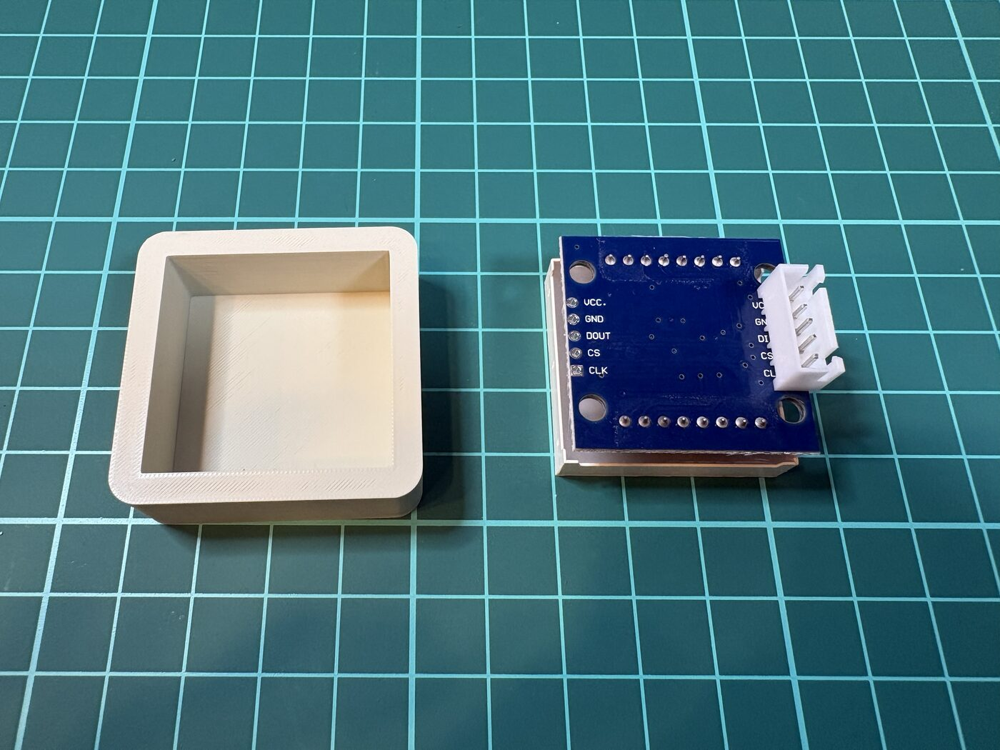

図 3: ヘッダは DIN と書かれた側に付けます。左の列が DOUT、右の列が DIN です。

ヘッダを付けたら、LED の面を下にしてトレイに落とし込みます。基板の裏が上を向き、コネクタがトレイの縁から出ている状態になれば正しく入っています。

## 2. XIAO にヘッダを付ける

XIAO のパッドはどちらの列も端から使うわけではないので、位置を確かめてからはんだ付けします。図 4 は裏面（シルクにピン名が書かれている面）から見たものです。

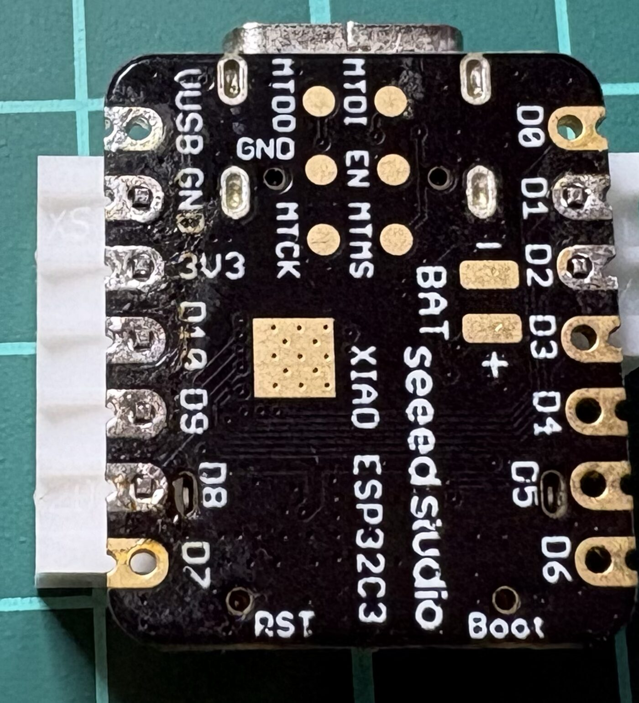

図 4: 左列は GND から D8 までの 5 パッド、右列は D1 と D2 の 2 パッドにヘッダを付けます。

| 列 | ヘッダ | パッド | つなぐ先 |
|---|---|---|---|
| 5V 側の列 | 5 ピン | GND / 3V3 / D10 / D9 / D8 | マトリクス(※GNDのみボタン共用) |
| D0 側の列 | 2 ピン | D1 / D2 | ボタン |

## 3. ハーネスを作る

結線は図 5 のとおりです。XIAO の 5 ピンとマトリクスの 5 ピンは 4 本の色線で直結し、GND だけは XIAO から出た 1 本を途中で 3 本に分岐させて、マトリクスと両方のボタンに配ります。分岐は熱収縮チューブで覆います。

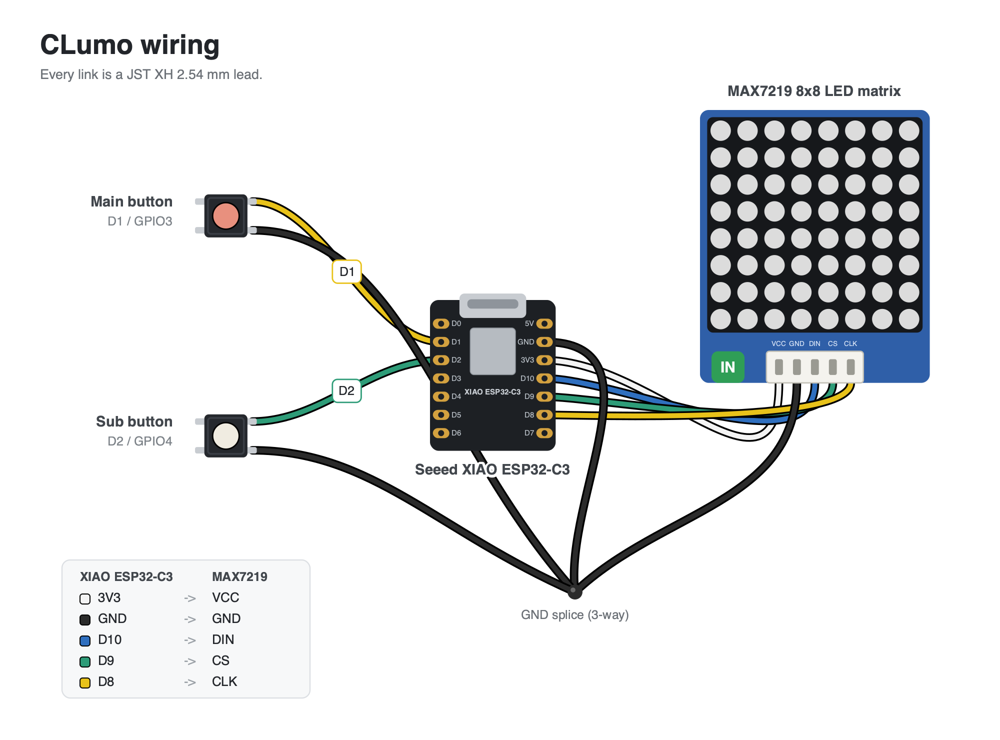

図 5: 結線は 5 本のマトリクス側と 2 本のボタン側で、GND だけが 1 本から 3 つに分かれます。

ボタン側は 3 ピンのハウジングを使いますが、圧着するのは両端の 2 極だけで、真ん中は空けます。XH の 2.54 mm ピッチ 2 つ分が、タクトスイッチの足の間隔にちょうど合うためです。各ボタンのハウジングには、XIAO の D1 または D2 から来る色線 1 本と、分岐した GND 1 本が入ります。できあがりは図 6 のようになります。

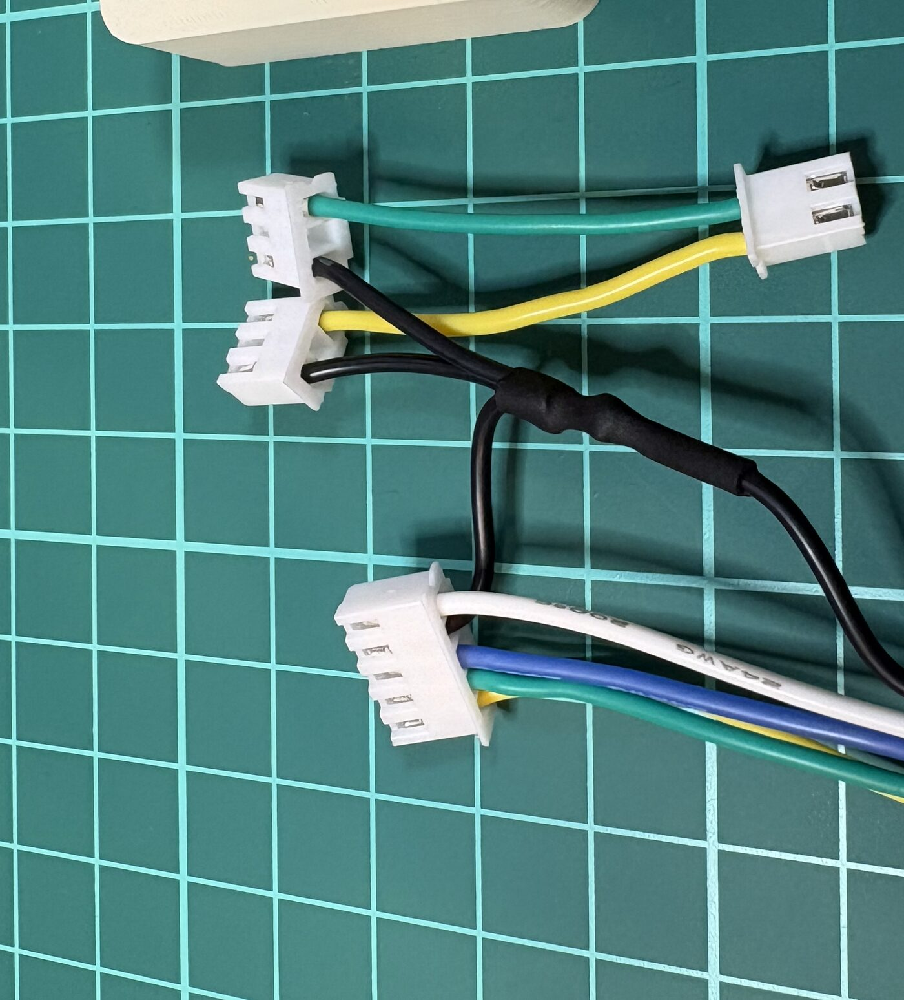

図 6: ハーネスは 5 つのハウジングで構成され、黒の GND だけが途中で 3 本に分かれます。

## 4. 骨格にスイッチを入れる

骨格の天板に、スイッチがはまる角穴が 2 つあります。そこに外側からタクトスイッチを押し込みます（図 7）。

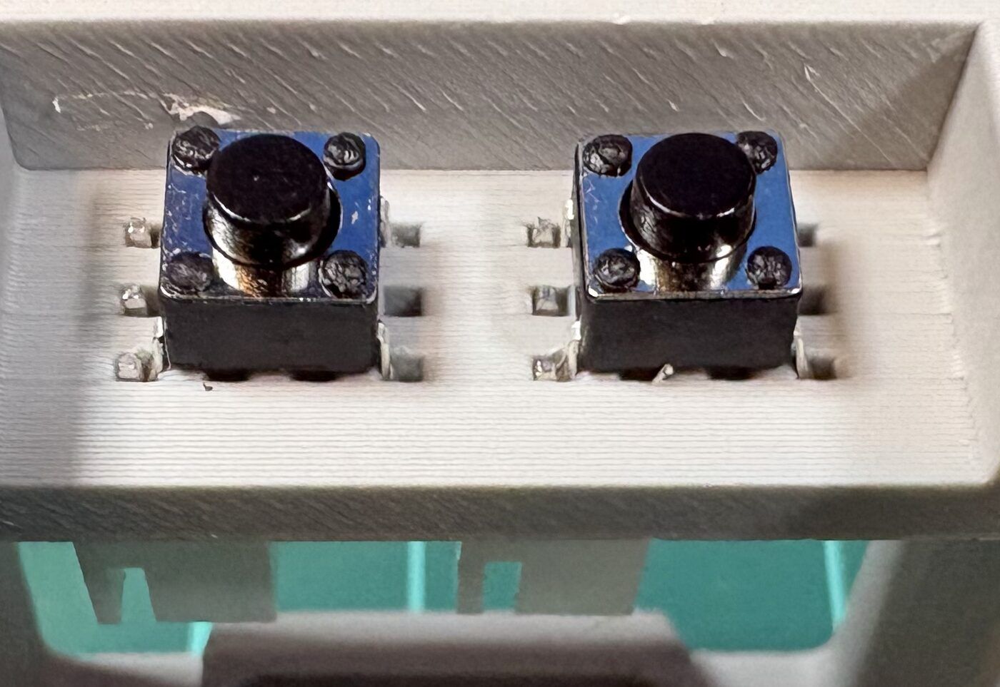

図 7: スイッチを外側から押し込むと、足が両脇のスリットに入ります。

次に、ハーネスの 3 ピンハウジングを骨格の内側から同じスリットに差し込みます。ハウジングの圧着コンタクトがスイッチの足に当たり、骨格の穴の締まりだけで固定されます（図 8）。はんだは使いません。

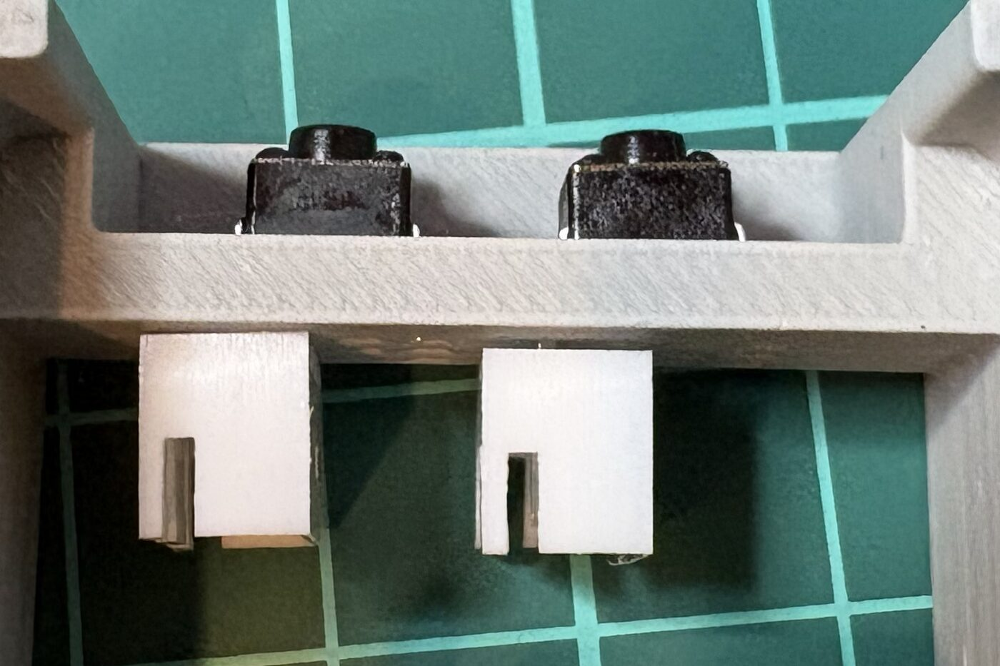

図 8: 3 ピンハウジングは下から差し込み、骨格の穴の締まりで留まります。

差し込む向きは、コンタクトが入っている両端の極がスイッチの足に来るようにします。真ん中の空いた極が中央のスリットに合えば正しい向きです。

差し込んだコンタクトはスリットから頭を出すので、そこをスイッチの足にはんだ付けしてもかまいません。ただしすぐ横が PLA で、溶かさずに付けるのは難しいです。圧着だけで十分に動くので、やるかどうかは自己判断でお願いします。

## 5. XIAO を骨格にはめる

骨格の中に XIAO を受ける爪付きのクレードルがあります。USB-C を背面（骨格の開いている側）に向け、シールド缶のある面を上にして押し込むと、少し硬いですがスナップフィットで留まります（図 9）。

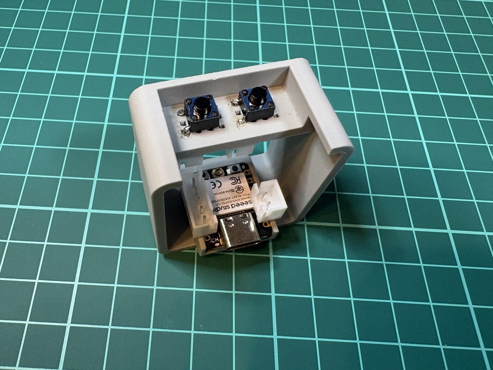

図 9: XIAO は USB-C を背面に向けてスナップフィットで留めます。

向きはこれ 1 通りです。逆にすると背面パネルの穴に USB-C が来ません。

## 6. 骨格の中でコネクタをつなぐ

骨格の中は狭く、天板と XIAO の隙間で作業することになります。

> XIAO の 5 ピンコネクタとボタンのハウジングは位置が重なりコツが入ります。他にも方法があるかもですが、自分は以下の手法で入れてます。
> 1. まず両方のボタンの 3 ピンハウジングを差し込む（手順 4）
> 2. XIAO の 2 ピンに D1 / D2 のハウジングを差す
> 3. 最後に XIAO の 5 ピンを、USB-C 側から少しスライドさせるように差す

つなぎ終わると図 10 のようになります。マトリクスへ行く 5 本は上へ抜いたままにしておきます。

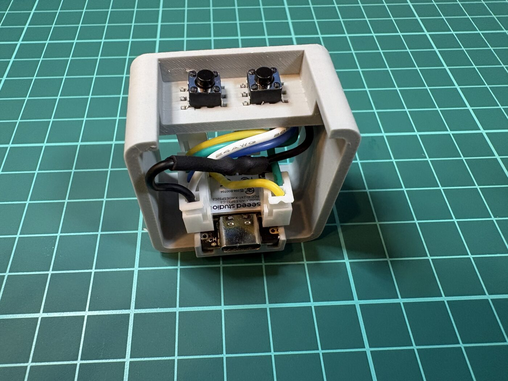

図 10: マトリクスへ行くケーブル以外がすべてつながった状態です。

## 7. トレイと骨格を合わせる

マトリクスの 5 ピンコネクタにハーネスを差し、トレイと骨格を向き合わせて重ねます（図 11）。

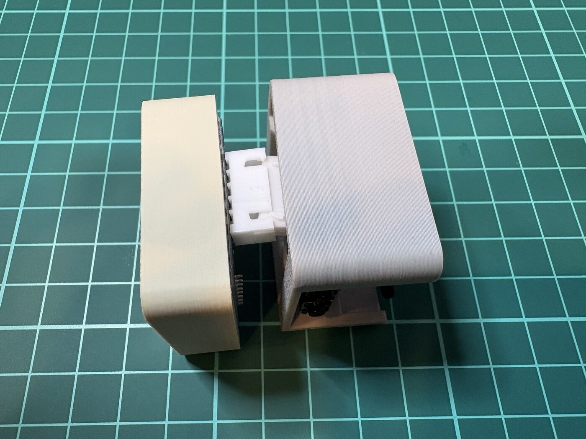

図 11: トレイと骨格はコネクタ 1 つでつながります。

## 8. 外装に入れる

外装シェルには口が 2 つあります。正面の少し小さい口が LED の窓、背面の広い口が中身を入れる側です。次の 4 つを合わせて、広い口から押し込みます（図 12）。

| 合わせるもの | 位置 |
|---|---|
| トレイ（白） | 正面の小さい口 |
| 骨格（灰色） | 背面の広い口 |
| 丸穴 2 つの面 | 上 |
| USB-C | 下 |

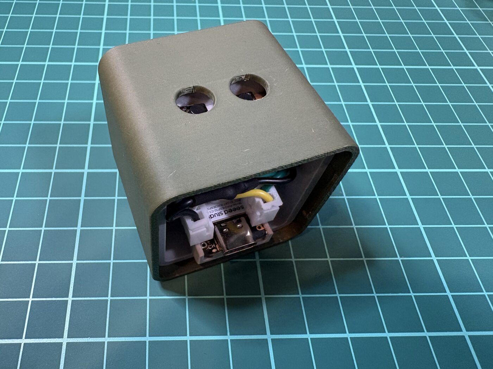

図 12: 正しく入ると、天面の丸穴からスイッチが、背面の下側から USB-C が見えます。

## 9. ボタンを付ける

ボタンは外側から付けます。まずキャップを天面の丸穴に入れ（図 13）、そのあと軸受のリングをキャップの周りにねじ込みます（図 14）。軸受が穴に圧入で留まり、キャップの抜け止めになります。

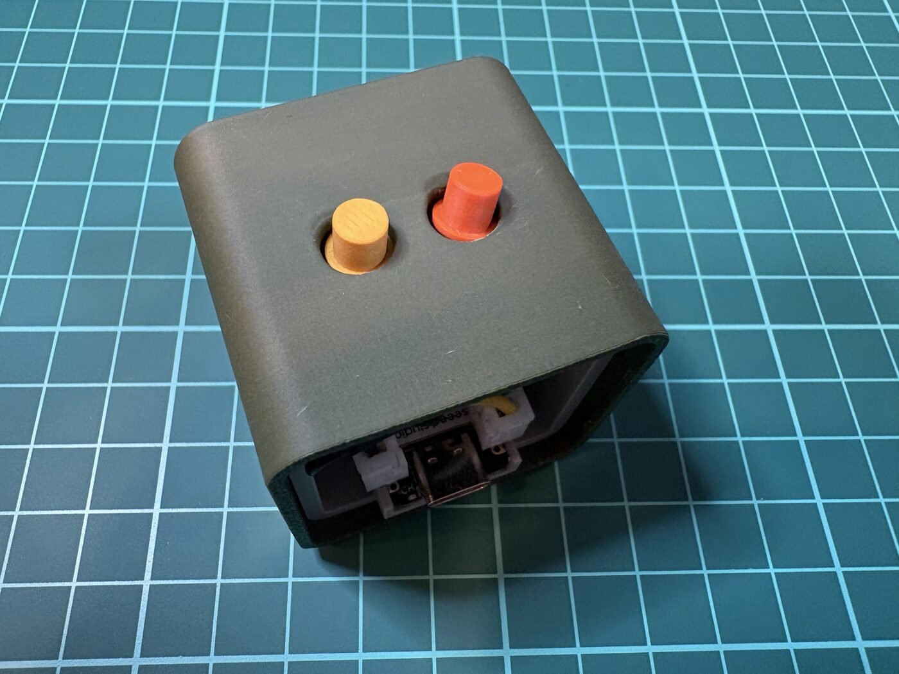

図 13: キャップを先に穴へ入れます。

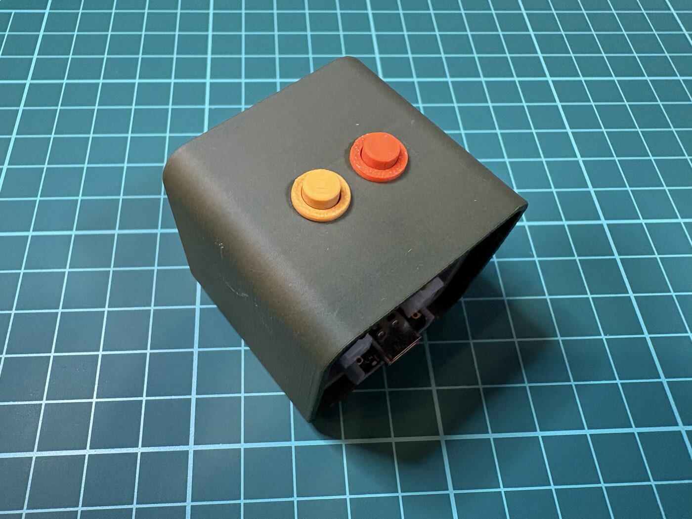

図 14: 軸受をねじ込むとボタンが完成します。

## 10. 背面パネルをはめる

背面パネルは USB-C の穴が下に来る向きではめます（図 15）。

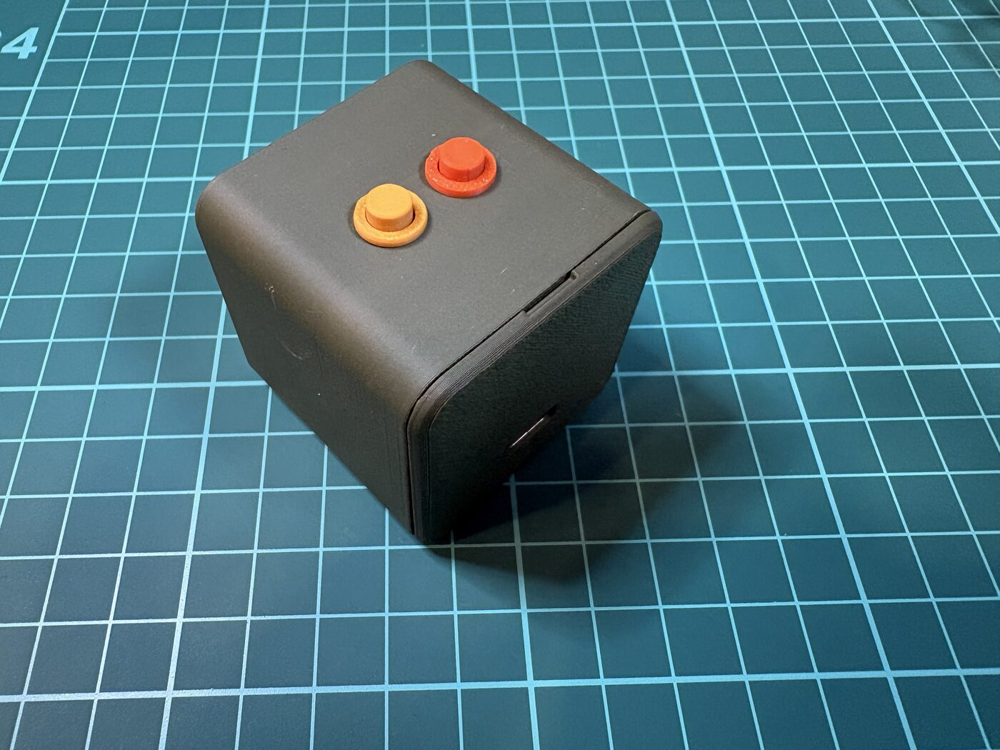

図 15: 背面パネルは USB-C の穴を下にしてはめます。

## 11. ファームウェアを書き込む

背面の穴から USB-C ケーブルをつなぎ、ファームウェアを書き込みます。書き込みが終わって表示が出れば完成です（図 16）。

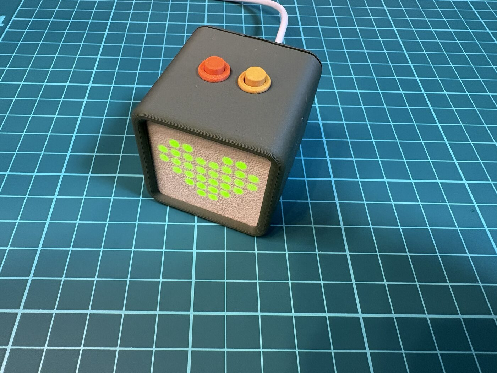

図 16: 書き込みが終わると表示が出ます。
