# CLumo Standalone Firmware

[English] | [日本語 (README.ja.md)](README.ja.md)

Standalone firmware for CLumo. It holds a few simple features that run on nothing but
the two buttons and the LED matrix.

There is no radio, no app, and no pairing: plug in power and everything works with just
the two buttons. Three modes are built in. The current mode is saved to flash, so the
device comes back in the same mode after a power cycle; a running pomodoro and the pet's
mood carry across a mode switch but not across a power cycle.

In the pictures below the left button is orange and the right one is white. Read them as
whatever filament you printed yours with.

## Switching modes

Hold **white** for a second or more. CLumo flashes the icon of the mode it is moving to,
then shows that mode.

| Icon | Mode | What it does |
|:---:|---|---|
| 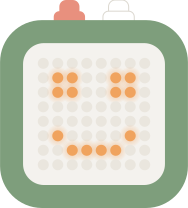 | **Pet** | A tiny digital pet that gets hungry over time. Feed it and keep it happy. |
|  | **Pomodoro** | 25 minutes of work, 5 minutes of break, shown as 64 pixels going out. |
| 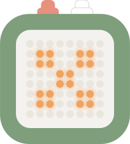 | **Dice** | Roll a die with one press. |

## Pet

The face is the pet's mood, and the mood follows its hunger: 100 is full, 0 is starving.
It starts at 50 and loses one point every 18 seconds, so an untouched pet goes from
content to sulking in about 3 minutes and to angry in about 12. Feeding adds 20.

| Face | Hunger | Meaning |
|:---:|:---:|---|
|  | 70-100 | Happy. It was fed recently. |
|  | 40-69 | Content. This is where it starts. |
|  | 10-39 | Sad. It wants to be fed. |
|  | 0-9 | Angry. Feed it now. |

Between moods the pet is never quite still:

| Face | When you see it |
|:---:|---|
| 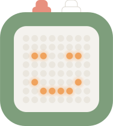 | A blink. Happy, content and sad pets blink every couple of seconds; an angry pet just glares. |
| 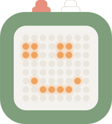 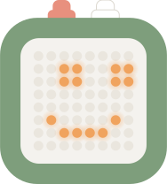 | Looking around. Every 5 to 15 seconds it glances left, then right. |

Orange feeds it: hunger goes up by 20 and the pet beams for a moment. White pokes it, and
it scowls for a moment before settling back into its mood.

## Pomodoro

The matrix is the timer. Every phase starts with all 64 pixels lit and they go out one by
one, from the top-left toward the bottom-right, so the lit block shrinking toward the
bottom-right corner is time running out.

| Screen | What it means |
|:---:|---|
|  | Idle. Nothing is counting. Press orange to start 25 minutes of work. |
| 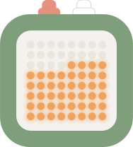 | About a third of the way through a phase. Work and break look the same. |
|  | About two thirds of the way through. |
| 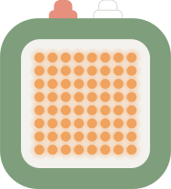 | A phase has ended. The whole matrix flashes three times, then the next phase starts on its own: a 5-minute break after work, 25 minutes of work after a break. |

Orange starts the timer when it is idle, pauses it when it is counting, and resumes it
when it is paused; a pause freezes the picture where it is. White resets to idle from any
state.

Both buttons are ignored while the matrix is flashing. Switching to another mode does not
stop the timer: it keeps counting, and you find it where it got to when you come back.

## Dice

The matrix rests on the last roll; a freshly started CLumo shows a five. Press orange and
faces flip past for about a second and a half, slowing down before they land on the result.

| 1 | 2 | 3 | 4 | 5 | 6 |
|:---:|:---:|:---:|:---:|:---:|:---:|
|  | 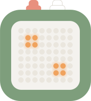 | 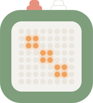 | 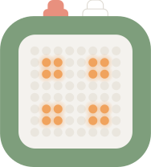 |  | 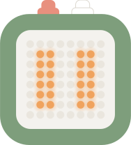 |

Orange rolls, and a press while a roll is still spinning is ignored. White has no effect
in this mode.

## Buttons at a glance

| | Orange | White |
|---|---|---|
| **Any mode** | | Hold for a second: next mode |
| **Pet** | Feed | Poke |
| **Pomodoro** | Start / pause / resume | Reset to idle |
| **Dice** | Roll | |

## Build & flash

### Requirements

- Rust nightly with the `rust-src` component. If you use rustup,
  `rust-toolchain.toml` installs it automatically.
- `ldproxy` and `espflash`:

  ```bash
  cargo install ldproxy espflash
  ```

- Python 3.10 or newer
- ESP-IDF v5.2.2

### Flash

Connect the board over USB-C and run:

```bash
cargo run
```

This builds the firmware, flashes it with `espflash`, and opens the serial
monitor.

## Appendix: pin assignments

The board is a Seeed Studio XIAO ESP32C3 and the matrix is a MAX7219.

| GPIO | Connected to | Direction |
|:---:|---|---|
| 8 | Matrix SCLK | Output (SPI) |
| 9 | Matrix CS | Output (SPI) |
| 10 | Matrix MOSI | Output (SPI) |
| 3 | Orange button | Input, internal pull-up (low when pressed) |
| 4 | White button | Input, internal pull-up (low when pressed) |
